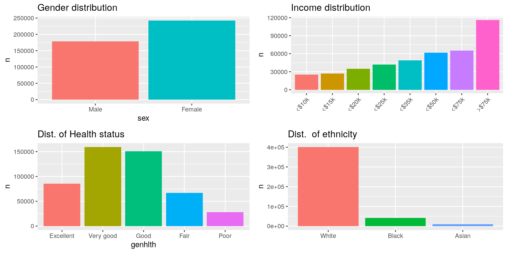
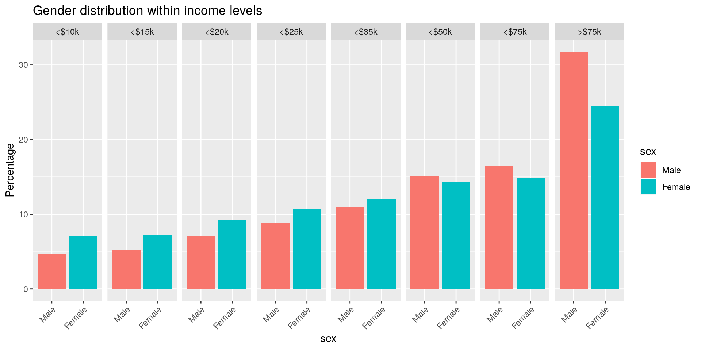
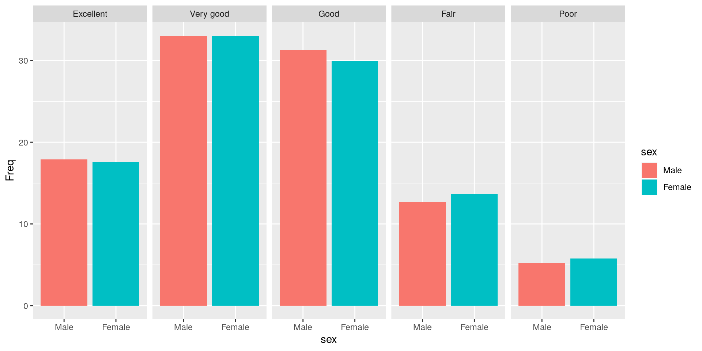
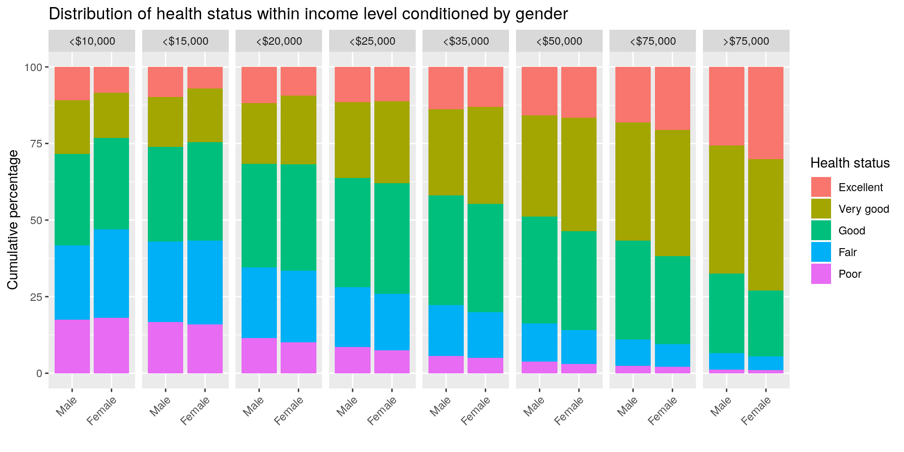
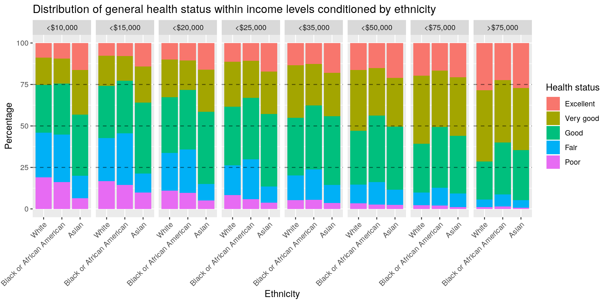

::: {.container-fluid .main-container}
::: {#header .fluid-row}
# Exploring the BRFSS data {#exploring-the-brfss-data .title .toc-ignore}
:::

::: {#setup .section .level2}
## Setup

::: {#load-packages .section .level3}
### Load packages

::: {#cb1 .sourceCode}
``` {.sourceCode .r}
library(ggplot2)
library(dplyr)
library(plyr)
library(tidyr)
library(gridExtra)
library(knitr)
library(reshape2)
```
:::
:::

::: {#load-data .section .level3}
### Load data

::: {#cb2 .sourceCode}
``` {.sourceCode .r}
load("brfss2013.RData")
```
:::

------------------------------------------------------------------------
:::
:::

::: {#part-1-data .section .level2}
## Part 1: Data

**Short Introduction** The [Behavioral Risk Factor Surveillance System
(BRFSS)](https://www.cdc.gov/brfss/index.html) is a US nationwide survey
regarding health-related risk behaviors, chronic health conditions, and
use of preventive services which is conducted annually since 1984. The
data for this survey is collected via telephone interviews over landline
or mobile phones on a randomly chosen sample. The BRFSS is an
observational study (as no treatment is either given or withheld),
therefore no causal inference concerning the collected data can be draw.
However, it is a means to screen for associations between the sampled
variables, which in turn might be the foundation for further
investigations in randomized experiments.

**Sampling strategy and generalizability of findings** Sampling for
landline and mobile surveys differed (see [BRFSS 2013
Overview](https://www.cdc.gov/brfss/annual_data/2013/pdf/Overview_2013.pdf)
p.6). While stratified sampling was applied to obtain landline numbers,
mobile phone numbers were obtained by dividing the complete set of
mobile phone numbers into a number of clusters equivalent to the desired
sample size, and subsequent sampling of one number from each cluster.

***Non-response bias*** While both methods sample phone numbers
randomly, great caution has to be taken, when generalizing findings to
the population at large due to the fact that non-responder rates are
high (50.4% and 62.2% for landline and mobile surveys, respectively, see
[BRFSS 2013 Quality
Report](https://www.cdc.gov/brfss/annual_data/2013/pdf/2013_DQR.pdf),
p.4).

***Convenience sample*** Additionaly, the sample might be biased towards
people that can be reached by phone. Parts of the population that do not
have (or want) acces to a phone or are less likely to answer (low
income, illegal immigrants, children) might be missed during sampling.

::: figure


[Lecture Slides - Week 1, Random Sample
Assignment](https://d3c33hcgiwev3.cloudfront.net/_c4665864796f7d7627b1374284f5ddd0_u1_p1_sp_random_sample_assignment.pdf?Expires=1585612800&Signature=RWQZRuluysxuOXSk2lyZjsAbGvaPBDFUSWNfCfldp0AoWlGosq-RRS4pd6jFj8hUowqrycA9qk-xRt2A7jSTODRW0S3Bhh5WejlkrmRqBPCQXhM5-0aDl056uxeu1w4Ui-VlLH1ZAjH-XkKHCX7d7ypOP8bjfaH5ygg~pzrA38M_&Key-Pair-Id=APKAJLTNE6QMUY6HBC5A)
:::

------------------------------------------------------------------------
:::

::: {#part-2-research-questions .section .level2}
## Part 2: Research questions

**Research quesion 1:** Is there an association between gender and
income level?

**Research quesion 2:** Is there an association between gender, income
level and general health status?

**Research quesion 3:** Is there and association between enthnicity
(White, Black or African American, Asian), income level and general
health status?

------------------------------------------------------------------------
:::

::: {#part-3-exploratory-data-analysis .section .level2}
## Part 3: Exploratory data analysis

**General EDA for variables associated with the research questions**

***Plot***

::: {#cb3 .sourceCode}
``` {.sourceCode .r}
#plots for each variable
eda_p1 <- 
  na.omit(brfss2013[,c('income2','sex')]) %>% dplyr::group_by(sex) %>% dplyr::count() %>%
  ggplot(aes(x=sex, y = n, fill=sex)) +
  geom_bar(stat='identity')

eda_p2 <- 
  na.omit(brfss2013[,c('income2','sex')]) %>% dplyr::group_by(income2) %>% dplyr::count() %>%
  ggplot(aes(x=income2, y = n, fill=income2)) +
  geom_bar(stat='identity')

eda_p3 <- 
  na.omit(brfss2013[,c('sex','genhlth')]) %>% dplyr::group_by(genhlth) %>% dplyr::count() %>%
  ggplot(aes(x=genhlth, y = n, fill=genhlth)) +
  geom_bar(stat='identity')

eda_p4 <- 
  na.omit(brfss2013[,c('sex','X_mrace1')]) %>% dplyr::group_by(X_mrace1) %>% dplyr::count() %>%
  filter(X_mrace1 == 'White' |
           X_mrace1 == 'Black or African American' |
           X_mrace1 == 'Asian') %>%
  ggplot(aes(x=X_mrace1, y = n, fill=X_mrace1)) +
  geom_bar(stat='identity')

#arranging plots in a grid
grid.arrange(
  eda_p1 + ggtitle("Gender distribution") + theme(legend.position = "none"),
  eda_p2 + ggtitle("Income distribution")
    + scale_x_discrete(labels=c('<$10k', '<$15k', '<$20k', '<$25k','<$35k', '<$50k', '<$75k', '>$75k')) 
    + theme(legend.position = 'none', axis.text.x = element_text(angle = 45, hjust=1)) 
    + xlab(""),
  eda_p3 + ggtitle("Dist. of Health status") + theme(legend.position = "none"),
  eda_p4 + ggtitle("Dist.  of ethnicity") + theme(legend.position = "none")
         + xlab("") + scale_x_discrete(labels=c('White', 'Black', 'Asian')),
  nrow = 2
) 
```
:::

{width="960"}
All distributions of variables that will be used in the subsequent
analysis are skewed.

***Summary statistics***

**Note on chosen summary statistics** As all variables used to address
the research questions are categorical, summary statistics will be
counts and proportions calculated for each variable.

------------------------------------------------------------------------

**Gender**

::: {#cb4 .sourceCode}
``` {.sourceCode .r}
kable(
  data.frame(
    na.omit(
      brfss2013[,c('income2','sex')]) %>%
      dplyr::count(sex) %>% 
      dplyr::mutate(p = round(100*n/sum(n),2))
    ),
  col.names = c('Sex', 'count', '%'),
  format='html',
  table.attr = "class=\"table table-condensed\" width=50%"
  )
```
:::

  Sex         count      \%
  -------- -------- -------
  Male       178186   42.39
  Female     242162   57.61

Women make up a total of 57.61% of participants, while they made up
about only 50.94% of the [US population in
2013](https://www.statista.com/statistics/737923/us-population-by-gender/).
In the 2013 BRFSS, there were 1.36 times more female than male
participants.

------------------------------------------------------------------------

**Income Level**

::: {#cb5 .sourceCode}
``` {.sourceCode .r}
kable(
  na.omit(
    brfss2013[,c('income2','sex')]) %>%
    dplyr::count(income2) %>% 
    dplyr::mutate(p = round((n/sum(n))*100,2)),
  col.names = c("Income", "count", "%"),
  format='html',
  table.attr = "class=\"table table-condensed\" width=50%"
)
```
:::

  Income                  count      \%
  -------------------- -------- -------
  Less than \$10,000      25441    6.05
  Less than \$15,000      26793    6.37
  Less than \$20,000      34873    8.30
  Less than \$25,000      41732    9.93
  Less than \$35,000      48867   11.63
  Less than \$50,000      61509   14.63
  Less than \$75,000      65231   15.52
  \$75,000 or more       115902   27.57

27.6% of participants earn more are in the highest income group, that is
approx. the same proportion as within the 4 lowest income groups taken
together.

------------------------------------------------------------------------

**Health Status**

::: {#cb6 .sourceCode}
``` {.sourceCode .r}
kable(
 na.omit(
   brfss2013[,c('sex','genhlth')]) %>% 
   dplyr::count(genhlth) %>% 
   dplyr::mutate(p = round((n/sum(n))*100,2)),
 col.names = c('Gen. Health', 'count', '%'),
  format='html',
  table.attr = "class=\"table table-condensed\" width=50%"
)
```
:::

  Gen. Health      count      \%
  ------------- -------- -------
  Excellent        85481   17.45
  Very good       159075   32.48
  Good            150555   30.74
  Fair             66726   13.62
  Poor             27951    5.71

Pariticipants with Good or Very Good general health status make up over
60% of all responders.

------------------------------------------------------------------------

**Ethnicity**

::: {#cb7 .sourceCode}
``` {.sourceCode .r}
kable(
  na.omit(brfss2013[,c('sex','X_mrace1')]) %>% 
  filter(X_mrace1 == 'White' |
         X_mrace1 == 'Black or African American' |
         X_mrace1 == 'Asian') %>% dplyr::count(X_mrace1) %>% 
  dplyr::mutate(p = round((n/sum(n))*100,2)),
  col.names = c('Ethnicity', 'count', '%'),
  format='html',
  table.attr = "class=\"table table-condensed\" width=50%"
)
```
:::

  Ethnicity                      count      \%
  --------------------------- -------- -------
  White                         400421   88.69
  Black or African American      41221    9.13
  Asian                           9850    2.18

In a subsample only considering White, Black/African American and Asian
ethinicity, the vast majority (88.7%) of the participants belongs to the
White ethnicity.

------------------------------------------------------------------------

**Conclusion** EDA of chosen variables revealed, that all of them are
skewed, i.e. are not uniformly distributed across factor levels. While
this might actually reflect the true distribution in the population,
care has to be taken, when conclusions based from these data are
generalized without any further checks, as it is possible that this
sample is biased (this has been discussed in [Part 1:
Data](#part-1-data))

------------------------------------------------------------------------

------------------------------------------------------------------------

**Comment on the significance of observed differences** All research
questions seek to investigate putative associations between variables.
Assuming no association, we would expect roughly equal distributions for
the factors of the response variable regardles of the chosen explanatory
variable. Any difference that might befound, reflects first and foremost
the difference within the given sample. Whether findings can be
generalized to the population at large is largely dependent on the
sampling strategy, as discussed above. In order to judge the
significance of any observed difference, tools of statistical inference
are required, which will not be used in this project. Therefore, I tried
to draw rather reluctant conclusions on the three research questions.
And still, all of them should be taken with a grain of salt and/or a
more thorough analysis.

------------------------------------------------------------------------

------------------------------------------------------------------------

**Research question 1**

**Is there an association between gender and income level?**\_

**Why would this be an interesting question?**

Gender equality is of great concern and a major topic in public
discussion. One of the major questions deals with justice when it comes
to salaries. Therefore exploring a putative association between gender
and income level is of particular interest.

***Table - Difference (%) between genders in income levels***

::: {#cb8 .sourceCode}
``` {.sourceCode .r}
#extract income and sex variables
inc_gender <-
  na.omit(brfss2013[,c('income2','sex')])

#remap factor labels for easier plotting
inc_gender$income2 =
  mapvalues(inc_gender$income2,
            from=levels(inc_gender$income2),
            to = c('<$10k', '<$15k', '<$20k', '<$25k',
                   '<$35k', '<$50k', '<$75k', '>$75k'))

#calculate proportions of income levels conditioned by gender
perc = inc_gender %>%
  dplyr::group_by(sex) %>%
  dplyr::count(income2) %>%
  dplyr::mutate(Freq = (n/sum(n))*100)

diff = data.frame(perc[perc$sex=='Male',]$Freq - perc[perc$sex=='Female',]$Freq)
colnames(diff) <- 'Difference (%)'
diff = t(diff)
colnames(diff) <- c("<$10k", "<$15k", "<$20k", "<$25k", "<$35k", "<$50k", "<$75k", ">$75k")
kable(round(diff,2),format = 'markdown')
```
:::

                     \<\$10k   \<\$15k   \<\$20k   \<\$25k   \<\$35k   \<\$50k   \<\$75k   \>\$75k
  ---------------- --------- --------- --------- --------- --------- --------- --------- ---------
  Difference (%)       -2.42      -2.1     -2.16     -1.91     -1.06      0.72      1.71      7.21

This table shows the percentage of male participants minus the
percentage of female participants for each income level. Therefore, a
negative value indicates more women within a given group. The gap
decreases with increasing income and is actually inversed for incomes
greater than \$50,000 (positive value indicates more men than women).
For addtiional interpretation see below.

::: {#cb9 .sourceCode}
``` {.sourceCode .r}
#general plot layout
p_p <- 
  perc %>%
  ggplot(aes(x=sex, y = Freq, fill=sex)) +
  geom_bar(stat='identity') +
  facet_grid(~income2)

#plot fine tuning
p_p +
  ggtitle("Gender distribution within income levels") +
  #xlab("Income level") +
  ylab("Percentage") +
  theme(axis.text.x = element_text(angle = 45, hjust=1))
```
:::

{width="960"}
**Interpretation** The plot shows the percentage of participants in each
income group, conditioned by gender. Women seem to be overrepresented in
income groups \<35,000\$. A striking difference is found in the highest
income group (\>75,000\$), where we find 7.21% more men than women (see
table above). If there was no association between income level and
gender, we would expect numbers for men in women in each group to be
roughly equal. This might be the case for all groups except \>\$75k,
where the difference appears more obvious.

**CAVEAT** In order to draw any substantial conclusion on the observed
differences, more research is needed, as well as tools from statistical
inference, which is out the scope of this project. The causal
conclusion, that women are paid less solely because of their gender,
would be invalid, if based only on this analysis, as there was no
control for confounding variables. Please refer to additional sources on
[Gender Pay Gap](https://en.wikipedia.org/wiki/Gender_pay_gap).

**Conclusion Question 1** The trends inferred from the plot indicate an
association between gender and income level within this sample.

**Reminder on generalizability of the findings** As discussed above,
findings from the analysis of this sample cannot be generalized to the
population and therefore can (if at all) only be indicative with respect
to the overall population. In order to draw any inference on the
relationship of these variables further research is needed.

------------------------------------------------------------------------

**Research question 2**

**Is there an association between gender, income level and general
health status?**

**Why would this be an interesting question?**

As an addon to question no. 1, this questions seeks to explore putative
associations between gender, income and general health.

***Plot 1***

::: {#cb10 .sourceCode}
``` {.sourceCode .r}
#extract income, sex and genhlth variables
inc_health_gender <-
  na.omit(brfss2013[,c('income2','sex', 'genhlth')])

#remap factor labels for easier plotting
inc_health_gender$income2 <-
  mapvalues(inc_health_gender$income2,
            from=levels(inc_health_gender$income2),
            to = c('<$10,000', '<$15,000', '<$20,000', '<$25,000',
                   '<$35,000', '<$50,000', '<$75,000', '>$75,000'))

#calculate proportions of gender in each health status group
perc_2 = inc_health_gender %>%
  dplyr::group_by(sex) %>%
  dplyr::count(genhlth) %>%
  dplyr::mutate(Freq = n*100/sum(n))

#general plot layout
p_p <- 
  perc_2 %>%
  ggplot(aes(x=sex, y = Freq, fill=sex)) +
  geom_bar(stat='identity') +
  facet_grid(~genhlth)

p_p
```
:::

{width="960"}

**Interpretation** A first analysis of the gender health status
distributions, reveals equal proportions between men and women for the
*Excellent* and *Very good* factor values. The difference is a little
more pronounced in the remaining groups, with women being
underrepresented in the *Good* group, while the remainder is divided
between the *Fair* and the *Poor* group. Taken together, within this
sample women are more likely to have a *Fair* or *Poor* health status.

**CAVEAT** As pointed out above, women were more likely to respond to
this survey. This might provide an explanation for women being
overrepresented in the groups with general health status: *If* people
with lower general health status have a lower probability to respond to
this survey, sampling more subjects could possibly include more subjects
with less likely attributes. For this reason, there might be more women
with lower general health status in the survey than men.

::: {#cb11 .sourceCode}
``` {.sourceCode .r}
#calculate proportions of health status in income levels conditioned by gender
perc_2 = inc_health_gender %>%
  dplyr::group_by(sex,income2) %>%
  dplyr::count(genhlth) %>%
  dplyr::mutate(Freq = n*100/sum(n))

#general plot layout
p_p2 <- 
  perc_2 %>%
  ggplot(aes(x=sex, y = Freq, fill=genhlth)) +
  geom_bar(stat='identity') +
  facet_grid(~income2)

#plot fine tuning
p_p2 +
  ggtitle("Distribution of health status within income level conditioned by gender") +
  xlab("") +
  ylab("Cumulative percentage") +
  theme(axis.text.x = element_text(angle = 45, hjust=1)) +
  scale_fill_discrete(name='Health status')
```
:::

{width="960"}

**Interpretation** An overall trend is easily visible, higher income
means better general health status for both men and women. This can be
inferred from the rising proportion of people with *Excellent* or *Good*
health status in higher income groups or the decreasing proportions of
people with health status *Poor*. When taking into account the
distribution of health status within income groups, it can be found that
for income levels \>\$20,000 women seem to be more likely to be in good
health (*Good* + *Very good* + *Excellent*). For the \<\$15,000 group,
distributions of health status are roughly equal between men and women,
while at very low incomes the effect seen in the higher income groups is
inversed.

**Conclusion Question 2** With the trends visible in Plot 2, gender,
general health status and income level seem to be associated within this
sample. Notably, the extent to which income level impacts health status
seems to be different for men and women.

**Reminder on generalizability of the findings** Same as for question 1

------------------------------------------------------------------------

**Research question 3:**

**Is there and association between race (White, Black or African
American, Asian), income level and general health status?**

**Why would this be an interesting question?**

Race has been described to possbily have an impact on
[income](https://www.payscale.com/data/racial-wage-gap-for-men) and
[health](https://www.ncbi.nlm.nih.gov/books/NBK425844/#sec_000047).

***Plot***

::: {#cb12 .sourceCode}
``` {.sourceCode .r}
#extract income and sex variables, filter for specific races
inc_health_eth <-
  na.omit(brfss2013[,c('income2','X_mrace1', 'genhlth')]) %>%
  filter(X_mrace1 == 'White' |
           X_mrace1 == 'Black or African American' |
           X_mrace1 == 'Asian')

#remap factor labels for easier plotting
inc_health_eth$income2 = mapvalues(inc_health_eth$income2,
                                   from=levels(inc_health_eth$income2),
                                   to = c('<$10,000', '<$15,000', '<$20,000', '<$25,000',
                                          '<$35,000', '<$50,000', '<$75,000', '>$75,000'))

#calculate proportions of income levels conditioned by ethnicity
perc_3 = inc_health_eth %>%
  dplyr::group_by(X_mrace1,income2) %>%
  dplyr::count(genhlth) %>%
  dplyr::mutate(Freq = (n/sum(n))*100)

#general plot layout
p_p3 <-perc_3 %>% ggplot(aes(x=X_mrace1, y = Freq, fill=genhlth)) +
  geom_bar(stat='identity') +
  facet_grid(~income2)

#plot fine tuning
p_p3 +
  ggtitle("Distribution of general health status within income levels conditioned by ethnicity") +
  xlab("Ethnicity") +
  ylab("Percentage") +
  theme(axis.text.x = element_text(angle = 45, hjust=1)) +
  scale_fill_discrete(name='Health status') +
  geom_hline(yintercept = c(25,50,75), linetype="dashed", alpha=0.5)
```
:::

{width="960"}
**Interpretation** The overall trend of general health status is the
same across income classes when conditioned for ethnicity: Higher
income - better overall health. Two interesting observations can be
made: 1) Asians seem to have a better general health status compared to
Whites and Black/African Americans especially in the lower income
levels. 2) While general health status of Whites and Black/African
Americans are comparable within the low income levels, Black/African
Americans seem to profit less from their higher income when it comes to
their overall health (smaller percentage with excellent health and
higher percentage of *Fair* + *Poor* health status compared to Whites
and Asians).

**Conclusion Question 3** With the trends visible in the plot above,
ethnicity, general health status and income level seem to be associated
within this sample. As we have seen for gender, race may influence the
impact of income level on general health status.

**Reminder on generalizability of the findings** Same as for question 1
:::
:::
