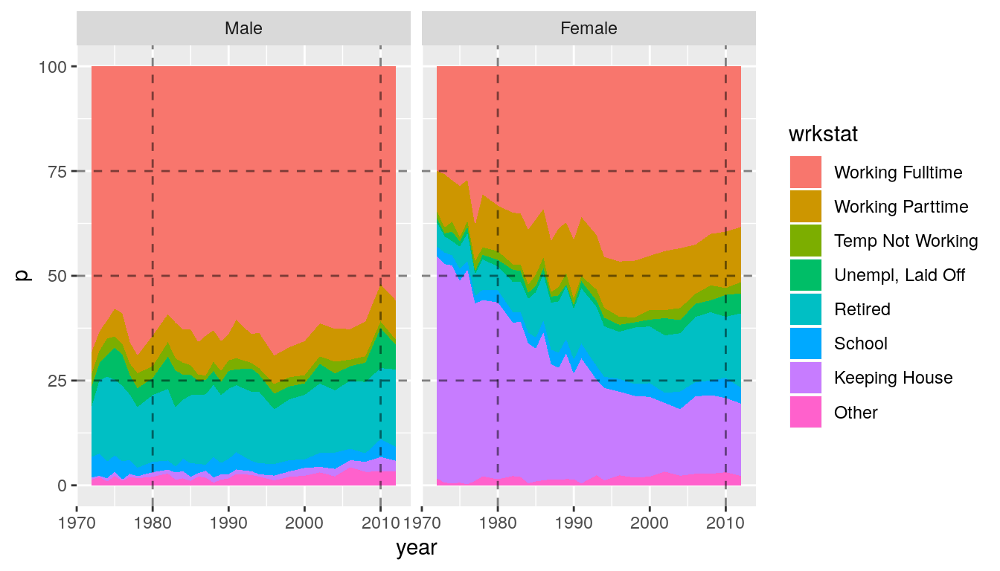
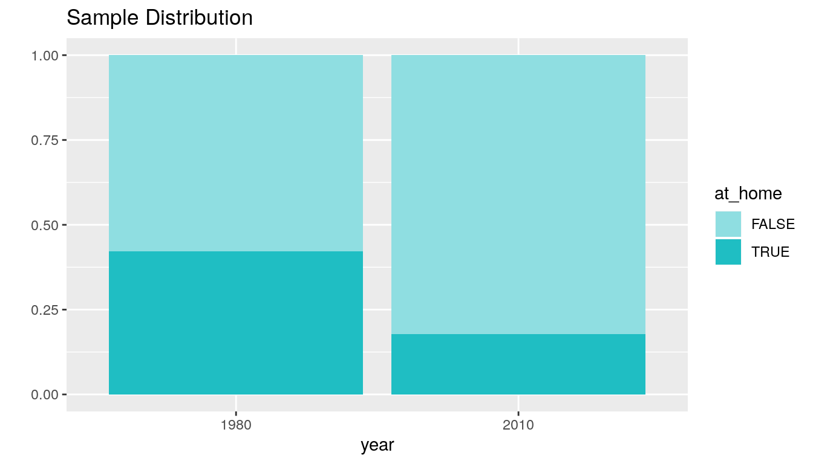
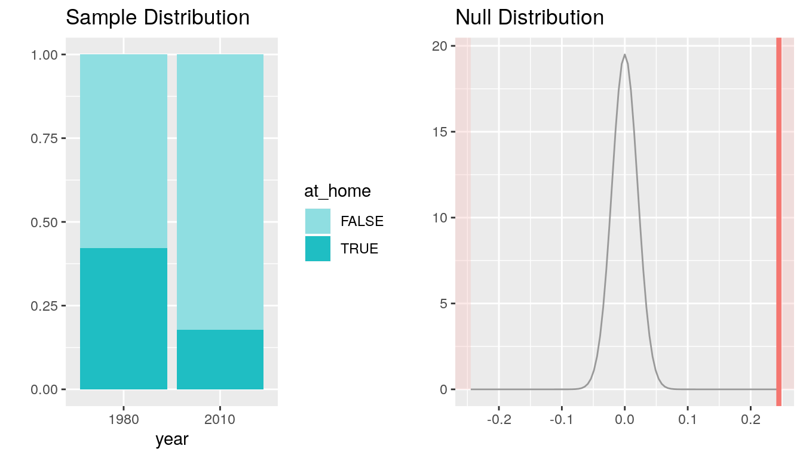

::: {.container-fluid .main-container}
::: {#header .fluid-row}
# Statistical inference with the GSS data {#statistical-inference-with-the-gss-data .title .toc-ignore}
:::

::: {#setup .section .level2}
## Setup

::: {#load-packages .section .level3}
### Load packages

::: {#cb1 .sourceCode}
``` {.sourceCode .r}
library(ggplot2)
library(dplyr)
library(knitr)
library(statsr)
```
:::
:::

::: {#load-data .section .level3}
### Load data

Make sure your data and R Markdown files are in the same directory. When
loaded your data file will be called `gss`. Delete this note when before
you submit your work.

::: {#cb2 .sourceCode}
``` {.sourceCode .r}
load("gss.Rdata")
```
:::

------------------------------------------------------------------------
:::
:::

::: {#part-1-data .section .level2}
## Part 1: Data

::: {#intro .section .level3}
### Intro

The General Social Survey is a US-nationwide sociological survey,
nowadays conducted biannually since 1972 to "gather data to monitor and
explain trends, changes, and constants in attitudes, behaviors, and
attributes as well as examine the structure, development, and
functioning of society in general as well as the role of various
sub-groups." ([ref. GSS on
Wikipedia](https://en.wikipedia.org/wiki/General_Social_Survey)).
:::

::: {#sampling-strategy-and-generalizability-of-findings .section .level3}
### Sampling strategy and generalizability of findings

The sample population includes English-speaking (and since 2006, Spanish
speaking) Americans over 18 living in "non-institutional arrangements"
(excluding people living in college dorms, military quarters, nursing
homes and long-term care facilities) within the US ([GSS
Introduction](http://www.gss.norc.org/documents/codebook/GSS_Codebook_intro.pdf),
p. 8).

Parts of the surveys of 1972-1974 and parts of the 1975 and 1976 surveys
used block quota sampling, while all remaining surveys employed full
probability sampling (GSS Introduction, p. 8; For detailed Sampling
Design see [Appendix
A](http://www.gss.norc.org/documents/codebook/GSS_Codebook_AppendixA.pdf)).

In quota sampling, a number of subjects with a certain characteristic
which is to be sampled is defined beforehand. Sampling continues until
the quota is fulfilled. It is a non-probabiblistic sampling strategy,
therefore the results are not generalizable to the population at large.

In contrast, the data acquired with full probability sampling can be
generalized from the sample to the population from which the sample was
taken (1978 - today).

**Convenience bias** A putative bias in surveys is sampling only
subjects that can easily be reached, which in this sampling framework
means e.g. people being at home. Measures have been taken to reduce this
bias as described in [Appendix
A](http://www.gss.norc.org/documents/codebook/GSS_Codebook_AppendixA.pdf),
p. 2).

**Non-responder bias** If too many people do not respond to a survey,
its generalizability might be limited (OpenIntro Statistics, p. 24). In
the GSS, temporary non-respondents are sub-sampled and the cases in this
sample where then pursued further to ensure a representative sample
([Appendix
A](http://www.gss.norc.org/documents/codebook/GSS_Codebook_AppendixA.pdf),
p. 19 ff.)

**Age bias** As pointed out above, included subjects are older than 18.
In addition, the condition to live in a household excludes a substantial
part of those 18-24 (9.4% in 1980) and of those 75 and older (11.4% in
1980), see [Appendix
A](http://www.gss.norc.org/documents/codebook/GSS_Codebook_AppendixA.pdf),
p. 1.

Taken together, conclusions from this data are not applicable neither to
children nor teenagers, while they can be generalized to the sampled
population, if interpreted carefully for the age groups 18-24 and \>75,
as these results may be skewed.
:::

::: {#causality .section .level3}
### Causality

The GSS is an observational study (no random assignment) and therefore
does not allow for any causal conclusions on any observed associations
between variables.

------------------------------------------------------------------------
:::
:::

::: {#part-2-research-question .section .level2}
## Part 2: Research question

Has the proportions of women keeping the house significantly changed
between 1980 and 2010?

Gender equality is one of the important discussions of our time, a major
demand of women during the last decades was unhindered access to the
labor market, therefore it is of interest to investigate whether less
(or more) women are staying at home to keep the house.

------------------------------------------------------------------------
:::

::: {#part-3-exploratory-data-analysis .section .level2}
## Part 3: Exploratory data analysis

**Workstatus over time**

::: {#cb3 .sourceCode}
``` {.sourceCode .r}
df = select(gss, year, sex, wrkstat) %>% 
      na.omit()  %>% group_by(year,sex) %>% 
      count(wrkstat) %>% mutate(p=100*n/sum(n))
```
:::

::: {#cb4 .sourceCode}
``` {.sourceCode .r}
df %>%
  ggplot(aes(x=year, y=p, fill=wrkstat)) + 
    geom_area() + facet_grid(~sex) + 
    geom_hline(yintercept = 50, alpha=0.5, linetype='dashed') +
    geom_hline(yintercept = 25, alpha=0.5, linetype='dashed') +
    geom_hline(yintercept = 75, alpha=0.5, linetype='dashed') +
    geom_vline(xintercept = 1980, alpha = 0.5, linetype='dashed') +
    geom_vline(xintercept = 2010, alpha = 0.5, linetype='dashed')
```
:::

{width="672"}

The plot shows the distribution of the workstatus over time conditioned
by gender. Changes for men seem to be less dynamic than for women over
this period of time.

::: {#cb5 .sourceCode}
``` {.sourceCode .r}
df %>% na.omit() %>% 
  filter(sex == "Female" & wrkstat == "Keeping House" & (year==1980 | year==2010)) %>%
  summarise(n = n,p=round(p,2))
```
:::

    ## # A tibble: 2 x 4
    ## # Groups:   year [2]
    ##    year sex        n     p
    ##   <int> <fct>  <int> <dbl>
    ## 1  1980 Female   349  42.2
    ## 2  2010 Female   204  17.7

**Table 1** shows the proportions of women which named "Keeping House"
as their workstatus in the samples of 1980 and 2010, respectively. There
is an observeddifference of -24.48 %.

------------------------------------------------------------------------
:::

::: {#part-4-inference .section .level2}
## Part 4: Inference

::: {#hypotheses .section .level3}
### Hypotheses

We need to state two hypotheses [\\(H_0\\)]{.math .inline} (null
hypothesis) and [\\(H_1\\)]{.math .inline} (alternative hypothesis). The
null hypothesis states that the data do not provide convincing evidence
that there is a significant difference between the samples with respect
to the chosen test statistic. [\\(H_0\\)]{.math .inline} instead states
that there is convincing evidence for a significant difference. An
important principle in inferential statistcs is to assume the null
hypothesis to be true, until finding evidence (e.g. using an hypothesis
test) that it is not.

------------------------------------------------------------------------

Applied within the framework of the research question, [\\(H_0\\)]{.math
.inline} would be :

There is no significant difference between the proportion of women
keeping the house in the 1980 and 2010 samples. Any observed difference
is likely due to chance.

[\\(H_0: p_1 - p_2 = 0\\)]{.math .inline}

------------------------------------------------------------------------

[\\(H_1\\)]{.math .inline}:

The data provide convincing evidence, that proportions of women keeping
the house in the 1980 and 2010 samples are significantly differnt. The
observed difference is very unlikely to be due to chance.

[\\(H_1: p_1 - p_2 \\neq 0\\)]{.math .inline}

------------------------------------------------------------------------

As can be seen in the equations for [\\(H_0\\)]{.math .inline} and
[\\(H_1\\)]{.math .inline}, the parameter of interest in this case is
the difference of the proportions of women keeping the house in the 1980
and 2010 samples.

------------------------------------------------------------------------
:::

::: {#variable-preparation .section .level3}
### Variable preparation

To facilitate hypothesis testing and to be able to construct a
confidence interval, the variable wrkstat with originally 8 levels will
be transformed will be transformed to a new variable *at_home* with two
levels.

::: {#cb7 .sourceCode}
``` {.sourceCode .r}
test <- select(gss, year, sex, wrkstat) %>% #select all important variables
  na.omit() %>%
  filter((year == 1980 | year == 2010) & sex == "Female") %>% #filter for female participants in 2010 and 1980
  mutate(at_home=wrkstat=="Keeping House",
         year=as.factor(year))
```
:::
:::

::: {#confidence-interval .section .level3}
### Confidence Interval

::: {#method-description .section .level4}
#### Method description

In contrast to a point estimate of a statistic (mean, median, sample
proportion), a confidence interval proposes a range of plausible values
for the chosen statistic for a chosen confidene level (here 95%).

The generic formula for a confidence interval:

[\\(point\\ estimeate \\pm z\^\* \* SE\\)]{.math .inline}

has to be adapted for the parameter of interest (difference of two
proportions) and the chosen confidence level:

[\\(\\hat{p_1}-\\hat{p_2} \\pm z\^\* \* \\sqrt{\\frac{p_1(1-p_1)}{n_1} +
\\frac{p_2(1-p_2)}{n_2}}\\)]{.math .inline}

The formula for the standard error used above holds true, only if the
Central Limit Theorem (CLT) can be applied. Therefore certain conditions
have to be checked, see below (conditions satisfied for construction of
a confidence interval).
:::

::: {#conditions-check .section .level4}
#### Conditions Check

**Independence** As for each turn of the GSS a new random sample is
created, the observations for 1980 and 2010 can be assumed to be
independent.

**Success-Failure-Condition**

::: {#cb8 .sourceCode}
``` {.sourceCode .r}
test %>% 
  group_by(year) %>% 
  count(at_home) %>% 
  mutate(p=round(n/sum(n),2)) %>%
  kable()
```
:::

  year   at_home       n      p
  ------ --------- ----- ------
  1980   FALSE       478   0.58
  1980   TRUE        349   0.42
  2010   FALSE       947   0.82
  2010   TRUE        204   0.18

The success-failure-condition requires at least 10 successes and at
least 10 failures for each group in order to construct a confidence
interval a confidence interval based on the CLT. As can be seen from
columns *n* of the table above, this conditions is satified.
:::

::: {#calculations .section .level4}
#### Calculations

::: {#cb9 .sourceCode}
``` {.sourceCode .r}
inference(y = at_home, 
          x = year, 
          data = test, 
          statistic = "proportion", 
          type = "ci", 
          alternative='twosided', 
          method = "theoretical", 
          success = TRUE)
```
:::

    ## Response variable: categorical (2 levels, success: TRUE)
    ## Explanatory variable: categorical (2 levels) 
    ## n_1980 = 827, p_hat_1980 = 0.422
    ## n_2010 = 1151, p_hat_2010 = 0.1772
    ## 95% CI (1980 - 2010): (0.2045 , 0.285)

{width="672"}
:::

::: {#interpretation .section .level4}
#### Interpretation

The plot gives the distribution of women keeping the house in the 1980
and 2010 samples. The text output gives a 95% confidence interval for
difference on the two proportions from 20.45% - 28.50%. This interval
has a 95% probability of containing the true population parameter. Note
that the interval does not include zero, which indicates, that the two
proportions are indeed significantly different.
:::
:::

::: {#hypothesis-test .section .level3}
### Hypothesis test

::: {#method-description-1 .section .level4}
#### Method description

A hypothesis test for a difference of two proportions based on the CLT
constructs the distribution of this difference under the assumptions
that the null hypothesis is true. It then gives the probability of
finding an equal or more extreme outcome with respect to the difference
observed form the two samples. This probability is also called
*p-value*. If the *p-value* is smaller than some chosen significance
level (very often 5%), we can conclude that the data provides convincing
evidence for rejection of the null hypothesis. We instead accept the
alternative hypothesis.
:::

::: {#conditions-check-1 .section .level4}
#### Conditions Check

As for the construction of a condifidence interval, certain conditions
have to be met in order to perform a hypothesis test on the difference
of two proportions.

**Independence** As for each turn of the GSS a new random sample is
created, the observations for 1980 and 2010 can be assumed to be
independent.

**Success-Failure-Condition** Checking the success-failure-condition for
a hypothesis test on the difference of two proportions is slightly
different compared to constructing a confidence interval. Instead of
checking it invidually for both samples with [\\(\\hat{p_1}\\)]{.math
.inline} and [\\(\\hat{p_2}\\)]{.math .inline} as estimates for the
population proportions, we will use the pooled proportion

[\\(\\hat{p}\_{pooled} =
\\frac{\\hat{p_1}n_1+\\hat{p_2}n_2}{n_1+n_2}\\)]{.math .inline}

for checking the success-failure-condition and to calculate the standard
error. This provides the best estimate for the proportion of successes
assuming that the null hypothesis is true.

::: {#cb11 .sourceCode}
``` {.sourceCode .r}
test %>% 
  group_by(year) %>% 
  count(at_home) %>% 
  mutate(p=round(n/sum(n),2)) %>%
  kable()
```
:::

  year   at_home       n      p
  ------ --------- ----- ------
  1980   FALSE       478   0.58
  1980   TRUE        349   0.42
  2010   FALSE       947   0.82
  2010   TRUE        204   0.18

In our case:

[\\(\\hat{p}\_{pooled} = \\frac{(349+204)}{349+478+204+947} =
0.2796\\)]{.math .inline}

**1980**

[\\(\\hat{p}\_{pooled} \\times n\_{success} = 0.2796 \\times 349 =
97\\)]{.math .inline}

[\\((1-\\hat{p}\_{pooled}) \\times n\_{failure} = 0.7204 \\times 478 =
344\\)]{.math .inline}

**2010**

[\\(\\hat{p}\_{pooled} \\times n\_{success} = 0.2796 \\times 204 =
57\\)]{.math .inline}

[\\((1-\\hat{p}\_{pooled}) \\times n\_{failure} = 0.7204 \\times 947 =
682\\)]{.math .inline}

The success-failure condition is satisfied since all values are at least
10.
:::

::: {#calculations-1 .section .level4}
#### Calculations

::: {#cb12 .sourceCode}
``` {.sourceCode .r}
inference(y = at_home, 
          x = year, 
          data = test, 
          statistic = "proportion", 
          type = "ht", 
          alternative='twosided', 
          method = "theoretical",
          null = 0,
          success = TRUE)
```
:::

    ## Response variable: categorical (2 levels, success: TRUE)
    ## Explanatory variable: categorical (2 levels) 
    ## n_1980 = 827, p_hat_1980 = 0.422
    ## n_2010 = 1151, p_hat_2010 = 0.1772
    ## H0: p_1980 =  p_2010
    ## HA: p_1980 != p_2010
    ## z = 11.9644
    ## p_value = < 0.0001

{width="672"}
:::

::: {#interpretation-1 .section .level4}
#### Interpretation

The plots give the distribution of women keeping the house in the 1980
and 2010 samples and the distribution for the difference of the two
proportions under the null hypothesis. The red line indicates the
observed difference, the area under the curve in the red shaded areas
give the probability of finding an equal or more extreme outcome (=
*p-value*). Obviously, this area is very small. This is reflected in the
text output which gives *p-value \< 0.0001*, we therefore can reject the
null hypothesis: the data provide convincing evidence that the observed
difference in the proportion of women keeping the house in 1980 and 2010
is statistically significant at the 5% significance level.
:::
:::

::: {#conclusion .section .level3}
### Conclusion

Both methods for inference on the difference of the proportions of women
keeping the house in 1980 and 2010 agree. The 95% CI does not include
zero, the *p-value* returned by the hypothesis test allows for rejection
of the null hypothesis. We can therefore conclude that the data provides
convincing evidence that the observed difference of -24.48% is not due
to chance (at the 5% significance level).
:::
:::
:::
