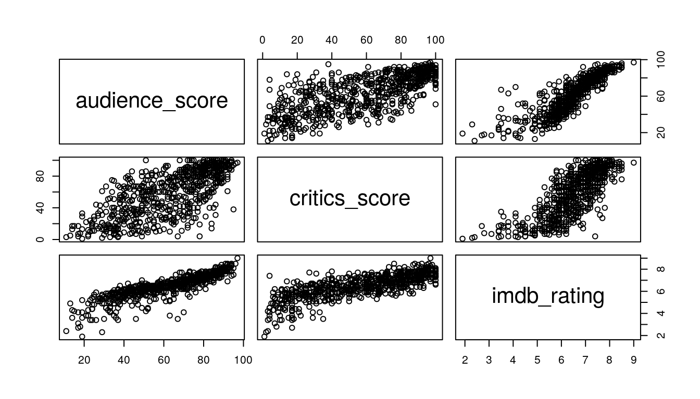
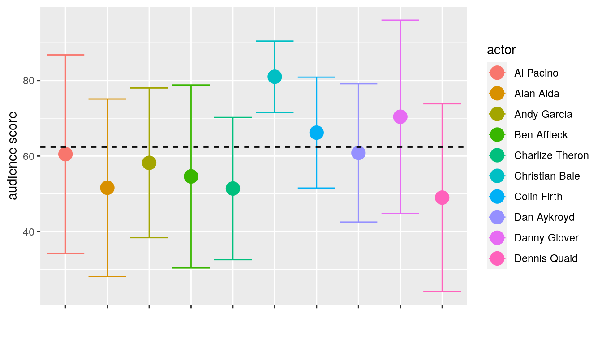
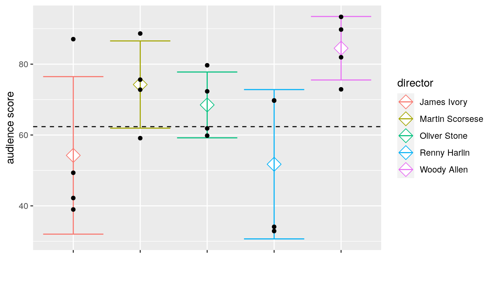
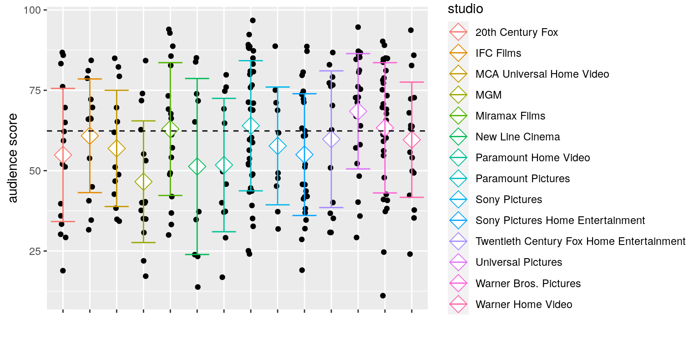
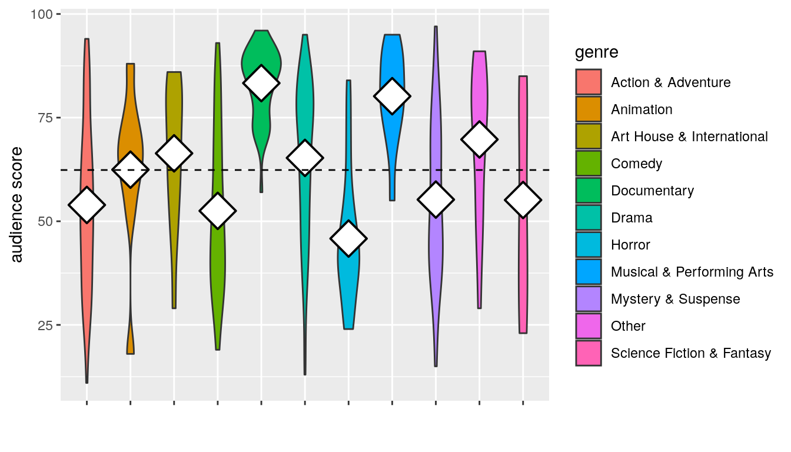
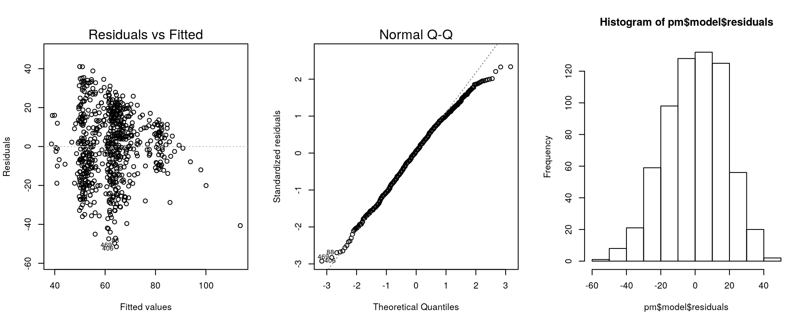

::: {.container-fluid .main-container}
::: {#header .fluid-row}
# Modeling and prediction for movies {#modeling-and-prediction-for-movies .title .toc-ignore}
:::

::: {#setup .section .level2}
## Setup

::: {#load-packages .section .level3}
### Load packages

::: {#cb1 .sourceCode}
``` {.sourceCode .r}
library(ggplot2)
library(dplyr)
library(statsr)
library(knitr)
library(broom)
library(leaps)
library(caret)
library(olsrr)
library(sjPlot)
```
:::
:::

::: {#load-data .section .level3}
### Load data

::: {#cb2 .sourceCode}
``` {.sourceCode .r}
load("movies.Rdata")
movies = as.data.frame(movies)
```
:::

------------------------------------------------------------------------
:::
:::

::: {#part-1-data .section .level2}
## Part 1: Data

The dataset contains data on 651 randomly chosen movies produced and
release before 2016. These are observational data, therefore no
causality can be inferred from an analysis. As a random sample was
obtained, the findings can be generalized to the population at large.

As there is no information as to from where the data was collected it is
difficult to comment on possible biases in the dataset. If the data was
gathered exclusively from IMDB and Rotten Tomatoes, one could imagine
that the data is biased to somewhat famous movies as smaller or less
known productions might not have been listed and/or rated on these
websites.

------------------------------------------------------------------------
:::

::: {#part-2-research-question .section .level2}
## Part 2: Research question

What are significant predictors for movie popularity?

------------------------------------------------------------------------
:::

::: {#part-3-exploratory-data-analysis .section .level2}
## Part 3: Exploratory data analysis

::: {#some-functions .section .level3}
### Some functions

::: {#cb3 .sourceCode}
``` {.sourceCode .r}
#Check whether an actor is in among the main 5 actors
get_actor <- function(r, actor){
  actor_cols = c('actor1', 'actor2', 'actor3', 'actor4', 'actor5')
  s = as.data.frame(t(r), col.names = names(r), stringsAsFactors=FALSE)
  if (actor %in% stack(s, actor_cols)$values){
    return('yes')
  } else {
    return('no')
  }
}
```
:::

::: {#cb4 .sourceCode}
``` {.sourceCode .r}
get_director <- function(r){
  s = as.data.frame(t(r), col.names = names(r), stringsAsFactors=FALSE)
  if (s['director'] %in% directors) {
    return(s['director'])
  } else {
    return('other')
  }
}

get_studio <- function(r){
  s = as.data.frame(t(r), col.names = names(r), stringsAsFactors=FALSE)
  if (s['studio'] %in% studios) {
    return(s['studio'])
  } else {
    return('other')
  }
}
```
:::
:::

::: {#choice-of-target-variable .section .level3}
### Choice of target variable

The dataset contains numeric variables that are highly correlated with
each other, as can be seen from the pairplot and the corresponding
correlation matrix.

::: {#cb5 .sourceCode}
``` {.sourceCode .r}
pairs(movies[,c('audience_score', 'critics_score', 'imdb_rating')])
```
:::

{width="672"}

::: {#cb6 .sourceCode}
``` {.sourceCode .r}
tidy(cor(movies[,c('audience_score', 'critics_score', 'imdb_rating')]))
```
:::

    ## Warning: 'tidy.matrix' is deprecated.
    ## See help("Deprecated")

    ## # A tibble: 3 x 4
    ##   .rownames      audience_score critics_score imdb_rating
    ##   <chr>                   <dbl>         <dbl>       <dbl>
    ## 1 audience_score          1             0.704       0.865
    ## 2 critics_score           0.704         1           0.765
    ## 3 imdb_rating             0.865         0.765       1

We can learn from this plot that (maybe or maybe not surprisingly)
critics and audience tend to agree in their ratings, as well as that
there is a high correlation between the two measures from Rotten
Tomatoes and the IMDB-rating. Information on how the scores are obtained
can be found on the websites of [Rotten
Tomatoes](https://www.rottentomatoes.com/about) and
[IMDB](https://help.imdb.com/article/imdb/track-movies-tv/ratings-faq/G67Y87TFYYP6TWAV?ref_=helpsect_cons_2_4#calculate),
respectively. Essentially, IMDB ratings and Audience Scores from Rotten
Tomatoes are measuring the same thing - whether the movies was liked by
the people who have seen it. So the high correlation is not surprising
and there might as well be redundancy concerning the information in
these two variables.

For this project I will choose `audience_score` as the response variable
and drop `critics_score` and `imdb_rating` due to their high
collinearity *and* redundant information.
:::

::: {#actors .section .level3}
### Actors

In order to explore associations between the audience score and actors,
we need to do some data manipulation. The columns containing the names
of the five main actors are stacked, missing values are removed and
finally appearances per actor are counted and stored.

::: {#cb9 .sourceCode}
``` {.sourceCode .r}
actor_cols = c('actor1', 'actor2', 'actor3', 'actor4', 'actor5')

#count appearances of actors over the whole dataset
df = stack(movies[,actor_cols]) %>%
  na.omit() %>% 
  group_by(values) %>% 
  count()

#get actors that appear in 5 or more movies
actors = df[df$n>=5,]$values

actors
```
:::

    ##  [1] "Al Pacino"         "Alan Alda"         "Andy Garcia"      
    ##  [4] "Ben Affleck"       "Charlize Theron"   "Christian Bale"   
    ##  [7] "Colin Firth"       "Dan Aykroyd"       "Danny Glover"     
    ## [10] "Dennis Quaid"      "Diane Keaton"      "Eddie Murphy"     
    ## [13] "Gene Hackman"      "Helen Hunt"        "Jamie Foxx"       
    ## [16] "Jeremy Northam"    "John Cusack"       "John Hurt"        
    ## [19] "John Travolta"     "Juliette Lewis"    "Keanu Reeves"     
    ## [22] "Mel Gibson"        "Michael Caine"     "Minnie Driver"    
    ## [25] "Naomi Watts"       "Nick Nolte"        "Nicolas Cage"     
    ## [28] "Richard Gere"      "Robert De Niro"    "Samuel L. Jackson"
    ## [31] "Sean Penn"         "Steve Martin"      "Steve Zahn"       
    ## [34] "Tom Cruise"        "Tommy Lee Jones"   "Val Kilmer"       
    ## [37] "Woody Harrelson"

There are 37 actors that appear in 5 or more movies within this dataset.
For visualisation we will extract, the mean and the standard deviation
of `audience_score` for each of these actors.

::: {#cb11 .sourceCode}
``` {.sourceCode .r}
eda_actors = data.frame()
colnames <- c('min', 'mean', 'max', 'n', 'sd','se')

#get summary statisics for actors with 5 or more appearances
for (a in actors) {
  temp <- movies %>% 
    na.omit() %>% 
    group_by(as.factor(apply(na.omit(movies), 1, get_actor, actor=a))) %>% 
    summarise(min=min(audience_score),
            mean=mean(audience_score),
            max=max(audience_score),
            n=n(),
            sd = sd(audience_score),
            se=sd(audience_score)/n())
  colnames(temp) <- c('isin', 'min', 'mean', 'max', 'n', 'sd','se')
  eda_actors <- rbind(eda_actors, as.data.frame(temp[temp$isin == 'yes',c('min', 'mean', 'max', 'n', 'sd','se')]))
}
rownames(eda_actors) <- actors
eda_actors['actor'] = actors
```
:::

::: {#cb12 .sourceCode}
``` {.sourceCode .r}
ggplot(eda_actors[1:10,], aes(x=actor, y=mean, fill=actor, color=actor)) + 
  geom_point(size=5) + 
  geom_errorbar(aes(ymin=mean-sd, ymax=mean+sd)) + 
  geom_hline(yintercept = mean(movies$audience_score),
             linetype='dashed',
             show.legend = TRUE) +
  theme(axis.text.x = element_text(color='white')) + 
  ylab('audience score') +
  xlab('')
```
:::

{width="672"}

The plot above shows the [\\(mean \\pm SD\\)]{.math .inline} of
`audience_score` conditioned on the first 10 actors with 5 or more
appearances, the dashed line indicates the mean of `audience_score` over
all movies. For most of the actors, the movies they appear in have a
rather large spread of audience score. Only the movies Christian Bale
plays in have a consistent high rating different from the overall mean,
which could prove useful for modeling.
:::

::: {#directors .section .level3}
### Directors

The same analysis can be conducted for directors that appear four or
more time in the dataset.

::: {#cb13 .sourceCode}
``` {.sourceCode .r}
reg = movies %>%
  group_by(director) %>%
  na.omit() %>%
  count()

directors = reg[reg$n>=4,]$director
directors
```
:::

    ## [1] "James Ivory"     "Martin Scorsese" "Oliver Stone"    "Renny Harlin"   
    ## [5] "Woody Allen"

::: {#cb15 .sourceCode}
``` {.sourceCode .r}
#refactoring the director variable
movies$director = as.factor(unlist(apply(movies, 1, get_director)))

eda_dir <- movies %>% 
  group_by(director) %>%
  summarise(min=min(audience_score),
            mean=mean(audience_score),
            max=max(audience_score),
            n=n(),
            sd = sd(audience_score),
            se=sd(audience_score)/n())
```
:::

::: {#cb16 .sourceCode}
``` {.sourceCode .r}
dir_p = eda_dir[eda_dir$director != 'other',] %>%
  ggplot(aes(x=director, y=mean, color = director, fill=director)) + 
  geom_point(size=5, shape=23, fill='white') + 
  geom_errorbar(aes(ymin=mean-sd, ymax=mean+sd)) + 
  geom_hline(yintercept = mean(movies$audience_score),
             linetype='dashed',
             show.legend = TRUE) +
  theme(axis.text.x = element_text(color='white')) + 
  ylab('audience score') +
  xlab('')
dir_p + geom_jitter(aes(director, audience_score), data = movies[movies$director!='other',],
                    position = position_jitter(0), color='black', show.legend = FALSE)
```
:::

{width="672"}

Data are [\\(mean \\pm SD\\)]{.math .inline} with individual films
indicated as black dots. As above the dashed line indicates the overall
mean. From the five directors with 4 or more movies in the dataset, only
Woody Allen's movies have a consistently high score.
:::

::: {#studios .section .level3}
### Studios

::: {#cb17 .sourceCode}
``` {.sourceCode .r}
stu = movies %>%
  group_by(studio) %>%
  na.omit() %>%
  count()
```
:::

    ## Warning: Factor `studio` contains implicit NA, consider using
    ## `forcats::fct_explicit_na`

::: {#cb19 .sourceCode}
``` {.sourceCode .r}
studios = stu[stu$n >= 10,]$studio
studios
```
:::

    ##  [1] 20th Century Fox                        
    ##  [2] IFC Films                               
    ##  [3] MCA Universal Home Video                
    ##  [4] MGM                                     
    ##  [5] Miramax Films                           
    ##  [6] New Line Cinema                         
    ##  [7] Paramount Home Video                    
    ##  [8] Paramount Pictures                      
    ##  [9] Sony Pictures                           
    ## [10] Sony Pictures Home Entertainment        
    ## [11] Twentieth Century Fox Home Entertainment
    ## [12] Universal Pictures                      
    ## [13] Warner Bros. Pictures                   
    ## [14] Warner Home Video                       
    ## 211 Levels: 20th Century Fox ... Zeitgeist Films

::: {#cb21 .sourceCode}
``` {.sourceCode .r}
#refactor the studio variable
movies$studio = as.factor(unlist(apply(movies, 1, get_studio)))

eda_studio <- movies %>% 
  group_by(studio) %>%
  summarise(min=min(audience_score),
            mean=mean(audience_score),
            max=max(audience_score),
            n=n(),
            sd = sd(audience_score),
            se=sd(audience_score)/n())
```
:::

::: {#cb22 .sourceCode}
``` {.sourceCode .r}
ggplot() + 
  geom_jitter(aes(x=studio, y = audience_score),
              data = movies[movies$studio!='other',],
              position = position_jitter(0.1)) + 
  stat_summary(aes(x=studio, y = audience_score, color=studio), data = movies[movies$studio!='other',], 
               fun=mean, geom='point', shape=23, size=5, fill='white') + 
  geom_errorbar(aes(x=studio, ymin = mean-sd, ymax=mean+sd, color=studio),
                data = eda_studio[eda_studio$studio!='other',]) + 
  geom_hline(yintercept = mean(movies$audience_score),
             linetype='dashed',
             show.legend = TRUE) +
  theme(axis.text.x = element_text(color='white')) + 
  ylab('audience score') +
  xlab('')
```
:::

{width="768"}

Data are [\\(mean \\pm SD\\)]{.math .inline} with individual films
indicated as black dots. When conditioned on the studio, there seem to
be quite some differences in `audience_score`. Most of these major
studios have a mean audience rating below the overall average.
:::

::: {#genre .section .level3}
### Genre

::: {#cb23 .sourceCode}
``` {.sourceCode .r}
movies %>%
  na.omit %>%
  group_by(genre) %>%
  ggplot(aes(genre, audience_score, fill=genre)) +
  geom_violin() +
  stat_summary(fun=mean, shape=23, size=2, fill='white') + 
  geom_hline(yintercept = mean(movies$audience_score),
             linetype='dashed',
             show.legend = TRUE) +
  theme(axis.text.x = element_text(color='white')) + 
  ylab('audience score') +
  xlab('')
```
:::

    ## Warning: Removed 11 rows containing missing values (geom_segment).

{width="672"}

This distribution plot reveals that Documentaries and Muscial movies
have scores above the overall average, while the inverse is the case for
Horror movies.

------------------------------------------------------------------------
:::
:::

::: {#part-4-modeling .section .level2}
## Part 4: Modeling

::: {#variable-encoding .section .level3}
### Variable encoding

I will use
[*One-Hot-Encoding*](https://hackernoon.com/what-is-one-hot-encoding-why-and-when-do-you-have-to-use-it-e3c6186d008f)
for the categorical variables that will be included in the model. This
allows to easily remove certain factor levels without releveling.

::: {#actors-1 .section .level4}
#### Actors

::: {#cb25 .sourceCode}
``` {.sourceCode .r}
for (a in actors) {
  movies[gsub(' ', '.', a)] = as.factor(apply(movies, 1, get_actor, actor = a))
}
```
:::

::: {#cb26 .sourceCode}
``` {.sourceCode .r}
movies_red = movies[append(gsub(' ', '.', actors), c('director',
                                                     'runtime',
                                                     'genre',
                                                     'studio',
                                                     'best_dir_win',
                                                     'best_actor_win',
                                                     'best_actress_win',
                                                     'audience_score'))] %>% 
  na.omit() #reduced dataset with all variables for the full model

movies_red <- within(movies_red,
                     director <- relevel(director, ref='other'))

movies_red <- within(movies_red,
                     studio <- relevel(studio, ref='other'))
```
:::
:::

::: {#directors-and-studios .section .level4}
#### Directors and Studios

::: {#cb27 .sourceCode}
``` {.sourceCode .r}
dmy <- dummyVars("~.", data = data.frame(director = movies_red$director,
                                         studio = movies_red$studio,
                                         genre = movies_red$genre))
dir_dummy <- data.frame(predict(dmy,
                                newdata = data.frame(director = movies_red$director,
                                                     studio = movies_red$studio,
                                                     genre = movies_red$genre))) %>% 
  lapply(as.factor) %>% 
  as.data.frame()

movies_red = data.frame(
  append(
    select(
      movies_red, -c('director', 'studio', 'genre') #dropping the original columns
      ), 
      select(
        dir_dummy, -c('director.other', 'studio.other', 'genre.Other') #drop the reference levels of studio and director
             )
    )
)
```
:::
:::
:::

::: {#full-model .section .level3}
### Full model

::: {#cb28 .sourceCode}
``` {.sourceCode .r}
md = lm(audience_score ~ ., data = movies_red)
smd = summary(md)
#print(smd, digits=1)
tab_model(md, p.style = 'asterisk')
```
:::

 
:::
:::
:::

audience_score

Predictors

Estimates

CI

(Intercept)

47.14 ^\*\*\*^

34.36 -- 59.92

Al.Pacino \[yes\]

-2.70

-18.37 -- 12.98

Alan.Alda \[yes\]

-22.24 ^\*^

-39.36 -- -5.12

Andy.Garcia \[yes\]

-3.87

-19.84 -- 12.10

Ben.Affleck \[yes\]

-18.90 ^\*^

-35.43 -- -2.36

Charlize.Theron \[yes\]

-12.62

-29.35 -- 4.11

Christian.Bale \[yes\]

11.41

-5.52 -- 28.34

Colin.Firth \[yes\]

-4.21

-21.16 -- 12.75

Dan.Aykroyd \[yes\]

-3.80

-19.22 -- 11.63

Danny.Glover \[yes\]

1.45

-15.62 -- 18.53

Dennis.Quaid \[yes\]

-8.03

-24.12 -- 8.05

Diane.Keaton \[yes\]

-0.70

-16.88 -- 15.47

Eddie.Murphy \[yes\]

-6.10

-22.53 -- 10.32

Gene.Hackman \[yes\]

5.71

-10.14 -- 21.55

Helen.Hunt \[yes\]

-2.74

-17.62 -- 12.14

Jamie.Foxx \[yes\]

-4.38

-19.01 -- 10.26

Jeremy.Northam \[yes\]

-3.62

-20.93 -- 13.69

John.Cusack \[yes\]

8.69

-6.29 -- 23.67

John.Hurt \[yes\]

-0.34

-14.89 -- 14.21

John.Travolta \[yes\]

-2.27

-16.35 -- 11.81

Juliette.Lewis \[yes\]

-1.40

-18.11 -- 15.31

Keanu.Reeves \[yes\]

14.43

-0.65 -- 29.51

Mel.Gibson \[yes\]

12.99

-3.43 -- 29.41

Michael.Caine \[yes\]

16.00

-0.91 -- 32.91

Minnie.Driver \[yes\]

17.42 ^\*^

0.38 -- 34.46

Naomi.Watts \[yes\]

-3.02

-20.66 -- 14.61

Nick.Nolte \[yes\]

-7.15

-21.76 -- 7.45

Nicolas.Cage \[yes\]

-15.12 ^\*^

-30.10 -- -0.14

Richard.Gere \[yes\]

-15.77 ^\*^

-28.81 -- -2.73

Robert.De.Niro \[yes\]

-7.27

-26.57 -- 12.03

Samuel.L..Jackson \[yes\]

11.84

-1.51 -- 25.18

Sean.Penn \[yes\]

0.06

-19.08 -- 19.20

Steve.Martin \[yes\]

7.11

-9.56 -- 23.78

Steve.Zahn \[yes\]

-1.36

-18.15 -- 15.43

Tom.Cruise \[yes\]

3.52

-13.77 -- 20.80

Tommy.Lee.Jones \[yes\]

-9.80

-26.86 -- 7.25

Val.Kilmer \[yes\]

13.49

-1.82 -- 28.80

Woody.Harrelson \[yes\]

-1.73

-16.93 -- 13.48

runtime

0.16 ^\*\*\*^

0.08 -- 0.25

best_dir_win \[yes\]

2.61

-4.44 -- 9.66

best_actor_win \[yes\]

-0.46

-5.93 -- 5.01

best_actress_win \[yes\]

1.26

-4.27 -- 6.80

director.James.Ivory \[1\]

-14.45

-32.88 -- 3.98

director.Martin.Scorsese\
\[1\]

4.94

-17.04 -- 26.93

director.Oliver.Stone \[1\]

3.72

-17.14 -- 24.58

director.Renny.Harlin \[1\]

-9.06

-27.02 -- 8.90

director.Woody.Allen \[1\]

26.49 ^\*^

6.11 -- 46.86

studio.20th.Century.Fox\
\[1\]

-3.92

-12.79 -- 4.95

studio.IFC.Films \[1\]

-2.05

-12.02 -- 7.92

studio.MCA.Universal.Home.Video\
\[1\]

2.52

-8.04 -- 13.08

studio.MGM \[1\]

-13.60 ^\*\*^

-22.74 -- -4.46

studio.Miramax.Films \[1\]

3.48

-6.20 -- 13.16

studio.New.Line.Cinema\
\[1\]

-12.76 ^\*^

-24.33 -- -1.18

studio.Paramount.Home.Video\
\[1\]

-12.71 ^\*^

-23.49 -- -1.94

studio.Paramount.Pictures\
\[1\]

2.88

-3.83 -- 9.59

studio.Sony.Pictures \[1\]

-1.74

-13.65 -- 10.18

studio.Sony.Pictures.Home.Entertainment\
\[1\]

-6.71

-14.18 -- 0.75

studio.Twentieth.Century.Fox.Home.Entertainment\
\[1\]

-2.63

-12.51 -- 7.25

studio.Universal.Pictures\
\[1\]

9.52 ^\*^

1.43 -- 17.62

studio.Warner.Bros..Pictures\
\[1\]

-1.55

-8.72 -- 5.62

studio.Warner.Home.Video\
\[1\]

-3.12

-12.02 -- 5.78

genre.Action...Adventure\
\[1\]

-9.71

-20.01 -- 0.59

genre.Animation \[1\]

2.57

-12.62 -- 17.75

genre.Art.House...International\
\[1\]

0.98

-12.31 -- 14.27

genre.Comedy \[1\]

-11.15 ^\*^

-21.37 -- -0.92

genre.Documentary \[1\]

20.07 ^\*\*\*^

9.54 -- 30.60

genre.Drama \[1\]

1.43

-8.03 -- 10.88

genre.Horror \[1\]

-13.46 ^\*^

-25.43 -- -1.49

genre.Musical...Performing.Arts\
\[1\]

16.12 ^\*^

2.44 -- 29.80

genre.Mystery...Suspense\
\[1\]

-9.02

-19.58 -- 1.53

genre.Science.Fiction...Fantasy\
\[1\]

-13.33

-28.35 -- 1.69

Observations

650

R^2^ / R^2^ adjusted

0.324 / 0.242

-   p\<0.05   \*\* p\<0.01   \*\*\* p\<0.001

The full model has an [\\(adjusted\\ R\^2\\)]{.math .inline} of 0.245
and accounts for 32.3% of the variance in the data ([\\(R\^2\\)]{.math
.inline} = 0.323). The majority of the variables has a small impact on
the response and/or is not statiscally significant, so we should be able
to remove some (a lot) of the predictors without the model getting
worse.

::: {#model-selection-based-on-p-values .section .level3}
### Model selection based on p-values

As I am rather interested in significant and important predictors for
`audience_score`, model selection will be based on *p-values*. Given the
large number of variables, the `ols_step_both_p` function from the
[`olsrr`
package](https://olsrr.rsquaredacademy.com/articles/variable_selection.html#stepwise-regression)
will be used. This function performs both forward and backward selection
and finally returns a model containing only statistically significant
predictors.

::: {#cb29 .sourceCode}
``` {.sourceCode .r}
pm = ols_step_both_p(md, prem=0.05)
```
:::

::: {#cb30 .sourceCode}
``` {.sourceCode .r}
par(mfrow=c(1,3))
plot(pm$model, which=c(1,2), add.smooth=FALSE)
hist(pm$model$residuals)
```
:::

{width="960"}

At a brief look at the final model diagnostics plots, there is no
visible pattern in the residuals. They are distributed somewhat normally
around zero with a slight left skew. All conditions seem to be
satisfied.

::: {#cb31 .sourceCode}
``` {.sourceCode .r}
tab_model(pm$model, p.style = 'asterisk')
```
:::

 
:::

audience_score

Predictors

Estimates

CI

(Intercept)

34.81 ^\*\*\*^

26.99 -- 42.63

genre.Documentary \[1\]

30.79 ^\*\*\*^

25.43 -- 36.14

genre.Drama \[1\]

10.24 ^\*\*\*^

7.23 -- 13.26

runtime

0.18 ^\*\*\*^

0.11 -- 0.25

genre.Musical...Performing.Arts\
\[1\]

24.73 ^\*\*\*^

14.35 -- 35.11

director.Woody.Allen \[1\]

30.53 ^\*\*\*^

13.10 -- 47.96

studio.MGM \[1\]

-11.76 ^\*\*^

-20.62 -- -2.90

Richard.Gere \[yes\]

-16.27 ^\*^

-28.82 -- -3.73

Christian.Bale \[yes\]

18.21 ^\*^

2.26 -- 34.17

studio.Universal.Pictures\
\[1\]

8.95 ^\*^

1.52 -- 16.39

genre.Art.House...International\
\[1\]

10.81 ^\*^

1.29 -- 20.33

Minnie.Driver \[yes\]

16.90 ^\*^

1.32 -- 32.49

Keanu.Reeves \[yes\]

14.66 ^\*^

0.43 -- 28.88

genre.Animation \[1\]

11.94 ^\*^

0.13 -- 23.75

Observations

650

R^2^ / R^2^ adjusted

0.256 / 0.240

-   p\<0.05   \*\* p\<0.01   \*\*\* p\<0.001

The final model contains considerably less variables, all being
statistically significant. Note that this smaller model has comparable
values for [\\(adjusted\\ R\^2 (0.240)\\)]{.math .inline} and [\\(R\^2\\
(0.256)\\)]{.math .inline}.

::: {#interpretation .section .level3}
### Interpretation

Regression coefficients have to be interpreted as average change of the
response when everthing else is held constant. With this in mind, we can
see that there are several genres (Documentary, Drama, Animation, Art
House, Musical) that have significantly higher scores. Longer films have
higher scores on average (0.18 points per minute runtime). Also some
actors have been identified to have a significant impact on the audience
score - not always for the better. An example: verything else held
constant, having Richard Gere in the cast leads to a decrease of -16.27
on average.

**CAVEAT** These are observational data, we cannot infere causality. So
we do not know whether the appearance of Richard Gere causes the movie
to be bad or whether there are other factors causing the bad rating.
Simply put - it could just be bad luck of Richard Gere to get casted for
inherently bad movies.

------------------------------------------------------------------------
:::

::: {#part-5-prediction .section .level2}
## Part 5: Prediction

::: {#café-society .section .level3}
### Café Society

::: {#sources .section .level4}
#### Sources

-   [Rotten Tomates](https://www.rottentomatoes.com/m/cafe_society_2016)
-   [IMDB](hhttps://www.imdb.com/title/tt4513674/)
-   [Wikipedia](https://en.wikipedia.org/wiki/Caf%C3%A9_Society_%282016_film%29)
:::

::: {#base-data .section .level4}
#### Base Data

::: {#cb32 .sourceCode}
``` {.sourceCode .r}
movie <- data.frame(actor1='Jeannie Berlin',
                    actor2='Steve Carell',
                    actor3='Jesse Eisenberg',
                    actor4='Blake Lively',
                    actor5='Parker Posey',
                    director='Woody Allen',
                    genre='Drama',
                    runtime=96,
                    studio='Amazon Studios',
                    audience_score=56)
```
:::
:::

::: {#data-manipulation .section .level4}
#### Data Manipulation

The variables of the movie whose `audience_score` we want to predict,
have to match the variables that were used to build the model.
Therefore, the same data preprocessing steps have to be applied.

::: {#cb33 .sourceCode}
``` {.sourceCode .r}
for (a in actors) {
  movie[gsub(' ', '.', a)] = as.factor(apply(movie, 1, get_actor, actor = a))
}

movie$studio = as.factor(unlist(apply(movie, 1, get_studio)))
movie$director = as.factor(unlist(apply(movie, 1, get_director)))

movie = movie[append(gsub(' ', '.', actors), c('director',
                                               'runtime',
                                               'genre',
                                               'studio',
                                               'audience_score'))]

dir_dummy <- data.frame(predict(dmy,
                                newdata = data.frame(director = movie$director,
                                                     studio = movie$studio,
                                                     genre = movie$genre))) %>% 
  lapply(as.factor) %>% 
  as.data.frame()

movie = data.frame(
  append(
    select(
      movie, -c('director', 'studio', 'genre') #dropping the original columns
      ), 
    select(
      dir_dummy, -c('director.other', 'studio.other', 'genre.Other') #drop the reference levels of studio, director and Genre
      )
    )
)
```
:::
:::

::: {#final-prediction-and-prediction-interval .section .level4}
#### Final Prediction (and Prediction Interval)

::: {#cb34 .sourceCode}
``` {.sourceCode .r}
pred = predict(pm$model, movie, interval = 'prediction', level = 0.95)
```
:::

The audience score on Rotten Tomatoes for *Café Society* is

[\\\[56\\\]]{.math .display}

while the final model predicts

[\\\[93\\\]]{.math .display}

with a prediction interval at the 95% confidence level of

[\\\[54 - 132\\\]]{.math .display}

**Interpretation of the prediction interval** We are 95% confident that
this interval contains the specific response
[\\(audicence\\\_score\^\*\\)]{.math .inline} corresponding to
[\\(x(Cafe\\ Society)\\)]{.math .inline}.

------------------------------------------------------------------------
:::
:::
:::

::: {#part-6-conclusion .section .level2}
## Part 6: Conclusion

Predicting `audience_score` of a movie only from information that would
be available before its release yields models with rather low predictive
power ([\\(R\^2\\)]{.math .inline} around 0.25, see above). If the cast
or the director won an oscar is does not have a significant effect (not
included in final model). That the prediction for *Café Society* is off
by **37** points illustrates the weaknesses of the model and the fact
that the predictors chosen in this work are not sufficient to predict
audience popularity before a movie's release, which is also partly due
to the choice of *p-values* as metric for model selection. The available
data provide mainly technical information on the movies but leave out
the most important parts - plot, mise-en-scène, music (composer of the
film score could be easily incorporated in the dataset), just to give a
few. In future work it might be interesting to look for ways to
represent these in a form making these information accessible for
modeling. Additionally, the current dataset should be enlarged in order
to 1) have more data for already included actor, directors etc. and 2)
to add even more these.
:::
