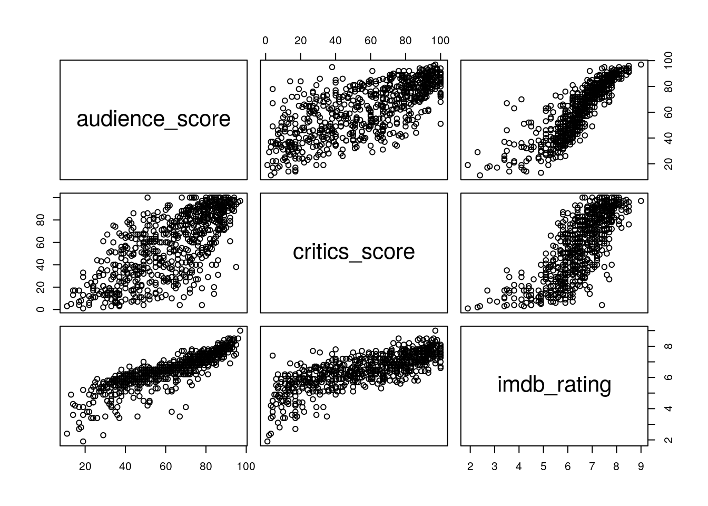
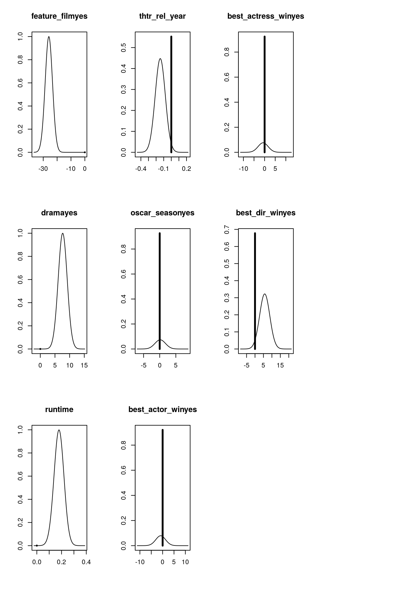

::: {.container-fluid .main-container}
::: {#header .fluid-row}
:::

::: {#setup .section .level2}
## Setup

::: {#load-packages .section .level3}
### Load packages

``` r
library(ggplot2)
library(dplyr)
library(statsr)
library(BAS)
library(broom)
library(MASS)
library(ggpubr)
library(gridExtra)
library(knitr)
```
:::

::: {#load-data .section .level3}
### Load data

Make sure your data and R Markdown files are in the same directory. When
loaded your data file will be called `movies`. Delete this note when
before you submit your work.

``` r
load("movies.Rdata")
movies = as.data.frame(movies)
```

------------------------------------------------------------------------
:::
:::

::: {#part-1-data .section .level2}
## Part 1: Data

The dataset contains data on 651 randomly chosen movies produced and
release before 2016. These are observational data, therefore no
causality can be inferred from an analysis. As a random sample was
obtained, the findings can be generalized to the population at large.
The target variable `audience_score` contains the audience score from
Rotten Tomatoes. Rotten Tomatoes is a metacritic site for movies,
i.e. it aggregates movie reviews over a variety of sources (e.g. IMDB
and movie critic articles). Therefore, one important task will be to
check for multicollinearity between explanatory variables and the
response variable (see below). \* \* \*
:::

::: {#part-2-data-manipulation .section .level2}
## Part 2: Data manipulation

*Feature Films*

``` r
movies = movies %>%
  dplyr::mutate(feature_film = ifelse(title_type == 'Feature Film', 'yes', 'no')) %>%
  dplyr::mutate(feature_film = as.factor(feature_film))
```

*Genre*

``` r
movies = movies %>%
  dplyr::mutate(drama = ifelse(genre == 'Drama', 'yes', 'no')) %>%
  dplyr::mutate(drama = as.factor(drama))
```

*MPAA rating*

``` r
movies = movies %>%
  dplyr::mutate(mpaa_rating_R = ifelse(mpaa_rating == 'R', 'yes', 'no')) %>%
  dplyr::mutate(mpaa_rating_R = as.factor(mpaa_rating_R))
```

*Oscar season*

``` r
oscar_months = c(11, 10, 12)
movies = movies %>%
  dplyr::mutate(oscar_season = ifelse(thtr_rel_month %in% oscar_months, 'yes', 'no')) %>%
  dplyr::mutate(oscar_season = as.factor(oscar_season))
```

*Summer*

``` r
summer_months = c(5,6,7,8)
movies = movies %>%
  dplyr::mutate(summer_season = ifelse(thtr_rel_month %in% summer_months, 'yes', 'no')) %>%
  dplyr::mutate(summer_season = as.factor(summer_season))
```

------------------------------------------------------------------------
:::

::: {#part-3-exploratory-data-analysis .section .level2}
## Part 3: Exploratory data analysis

*Feature Films*

``` r
ffp <- ggplot(movies, aes(y=audience_score, x=feature_film, fill=feature_film))  + 
  geom_violin() +
  stat_summary(fun=median, geom="point", shape=23, size=8, fill='white') + 
  theme(legend.position="none") +
  ggtitle('Feature Film')
```

*Drama*

``` r
dp <- ggplot(movies, aes(y=audience_score, x=drama, fill=drama))  + 
  geom_violin() +
  stat_summary(fun=median, geom="point", shape=23, size=8, fill='white') +
  theme(legend.position="none") +
  ggtitle('Drama')
```

*MPAA*

``` r
mpaap <- ggplot(movies, aes(y=audience_score, x=mpaa_rating_R, fill=mpaa_rating_R))  + 
  geom_violin() +
  stat_summary(fun=median, geom="point", shape=23, size=8, fill='white') + 
  theme(legend.position="none") +
  ggtitle('MPAA Rating')
```

*Oscar*

``` r
oscarp <- ggplot(movies, aes(y=audience_score, x=oscar_season, fill=oscar_season))  + 
  geom_violin() +
  stat_summary(fun=median, geom="point", shape=23, size=8, fill='white') + 
  theme(legend.position="none") +
  ggtitle('Oscar Season')
```

*Summer*

``` r
summerp <-ggplot(movies, aes(y=audience_score, x=summer_season, fill=summer_season)) + 
  geom_violin() +
  stat_summary(fun=median, geom="point", shape=23, size=8, fill='white') + 
  theme(legend.position="none") +
  ggtitle('Summer season')
```

``` r
grid.arrange(ffp, mpaap, oscarp, summerp, dp, ncol=4)
```

{width="768"}

The figure above shows violinplots for of the `audience_score` variable
with respect to all of the newly constructed variables with the median
of each distribution indicated by a white diamond. The distribution of
the audience score of movies with MPAA rating *R* has an additional high
density area in the low range of audience scores compared to movies with
a different rating. The variables `oscar_season` and `summer_season` are
basically just the inverse of one another, it should be enough to
include one of the variables (if at all).

For the last variable `drama`, distributions of the audience score are
quite different, indicating a higher audience score attributed to films
of the drama genre.

------------------------------------------------------------------------
:::

::: {#part-4-modeling .section .level2}
## Part 4: Modeling¨

::: {#preliminary-considerations-for-variable-selection .section .level3}
### Preliminary considerations for variable selection

The dataset contains variables that are highly correlated with the
response variable `audience_score`, as can be seen from the pairplot and
the corresponding correlation matrix.

``` r
pairs(movies[,c('audience_score', 'critics_score', 'imdb_rating')])
```

{width="672"}

``` r
tidy(cor(movies[,c('audience_score', 'critics_score', 'imdb_rating')]))
```

    ## Warning: 'tidy.matrix' is deprecated.
    ## See help("Deprecated")

    ## # A tibble: 3 x 4
    ##   .rownames      audience_score critics_score imdb_rating
    ##   <chr>                   <dbl>         <dbl>       <dbl>
    ## 1 audience_score          1             0.704       0.865
    ## 2 critics_score           0.704         1           0.765
    ## 3 imdb_rating             0.865         0.765       1

We can learn from this plot that (maybe or maybe not surprisingly)
critics and audience tend to agree in their ratings, as well as that
there is a high correlation between the two measures from Rotten
Tomatoes and the IMDB-rating. Information on how the scores are obtained
can be found on the websites of [Rotten
Tomatoes](https://www.rottentomatoes.com/about) and
[IMDB](https://help.imdb.com/article/imdb/track-movies-tv/ratings-faq/G67Y87TFYYP6TWAV?ref_=helpsect_cons_2_4#calculate),
respectively. Essentially, IMDB ratings and Audience Scores from Rotten
Tomatoes are measuring the same thing - whether the movies was liked by
the people who have seen it. So the high correlation is not surprising
and there might as well be redundancy concerning the information in
these two variables. It is probably a good idea to think about the
original purpose of modeling this particular problem. Sure, if we assume
that we model for modeling's sake, we should include either
`IMDB rating` or `critics_score` to predict `audience_score` (I actually
ran a model selection using the `stepAIC` function and the final model
retained included only `imdb_rating` - note very useful in my opinion).
If we think about this from a possible scenario where we attempt to
predict whether a movie will be liked by the audience based on some of
its characteristics such as *genre, director* etc. In this case, we
would avoid including `imdb_rating` as this information would not be
available before the release of the movie. The situation could be judged
a little different for `critics_score`. To me this seems like
information that could be available beforehand - but maybe not at a
timepoint where you could possible use information from modeling to
change the movie in order to improve the outcome.
:::

::: {#selecting-variables-for-modeling-from-allowed-variables .section .level3}
### Selecting variables for modeling from allowed variables

As there is no context given within the project description, modeling
will be performed from the perspective of someone who wants to predict
the popularity of a movie before its release, relying solely on
characteristics of the movie known beforehand.

``` r
# variables conatining information that is not available before a movies's release is commented out
movies_red <- na.omit(movies[,c(
  'feature_film',
  'drama',
  #'genre',
  'runtime',
  #'mpaa_rating_R',
  'thtr_rel_year',
  'oscar_season',
  #'summer_season',
  #'imdb_rating',
  #'imdb_num_votes',
  #'critics_score',
  #'best_pic_nom',
  #'best_pic_win',
  'best_actor_win',
  'best_actress_win',
  'best_dir_win',
  #'top200_box',
  'audience_score'
)])
```
:::

::: {#bayesian-model-averaging .section .level3}
### Bayesian Model Averaging

``` r
bma_red <- bas.lm(audience_score ~ .,
                  data = movies_red,
                  prior = 'ZS-null',
                  modelprior = uniform(),
                  )
```
:::

::: {#bma-summary .section .level3}
### BMA Summary

``` r
coef_bma <- coef(bma_red)
c <- data.frame(coef_bma$probne0, coef_bma$postmean, coef_bma$postsd)
colnames(c) <- c('post P(B != 0)', 'post. mean', 'post. SD')
rownames(c) <- coef_bma$namesx
kable(round(c,3))
```

                          post P(B != 0)   post. mean   post. SD
  --------------------- ---------------- ------------ ----------
  Intercept                        1.000       62.348      0.725
  feature_filmyes                  1.000      -25.961      2.641
  dramayes                         1.000        7.635      1.536
  runtime                          0.999        0.179      0.040
  thtr_rel_year                    0.447       -0.065      0.085
  oscar_seasonyes                  0.073        0.011      0.445
  best_actor_winyes                0.079       -0.068      0.647
  best_actress_winyes              0.076       -0.054      0.680
  best_dir_winyes                  0.322        1.850      3.183

``` r
par(mfcol=c(3,4))
plot(coef_bma, ask=FALSE, subset = 2:(length(coef_bma)-2))
```

{width="8"}

The table and plot above give the marginal posterior inclusion
probabilities and distributions for the explanatory variables. As can be
seen `feature_film`, `drama` and `runtime` have inclusion probabilities
of (or very close to) 1. Interpreting the posterior means of these
parameters gives on average a \~26 point reduction for feature films,
7.6 points increase for dramas and 0.179 additional point per additional
minute of runtime. The posterior means of the remaining variables could
be interpreted in a similar manner, but are skipped due to their low
inclusion probabilites.
:::

::: {#top5-models .section .level3}
### Top5 models

``` r
kable(round(summary(bma_red),3))
```

                          P(B != 0 \| Y)   model 1   model 2   model 3   model 4   model 5
  --------------------- ---------------- --------- --------- --------- --------- ---------
  Intercept                        1.000     1.000     1.000     1.000     1.000     1.000
  feature_filmyes                  1.000     1.000     1.000     1.000     1.000     1.000
  dramayes                         1.000     1.000     1.000     1.000     1.000     1.000
  runtime                          0.999     1.000     1.000     1.000     1.000     1.000
  thtr_rel_year                    0.447     0.000     1.000     0.000     1.000     0.000
  oscar_seasonyes                  0.073     0.000     0.000     0.000     0.000     0.000
  best_actor_winyes                0.079     0.000     0.000     0.000     0.000     1.000
  best_actress_winyes              0.076     0.000     0.000     0.000     0.000     0.000
  best_dir_winyes                  0.322     0.000     0.000     1.000     1.000     0.000
  BF                                  NA     1.000     0.846     0.508     0.349     0.077
  PostProbs                           NA     0.292     0.247     0.148     0.102     0.022
  R2                                  NA     0.167     0.173     0.172     0.177     0.167
  dim                                 NA     4.000     5.000     5.000     6.000     5.000
  logmarg                             NA    49.175    49.008    48.498    48.122    46.610

The top 5 models all include `feature_film`, `drama` and `runtime`.
Taken together these five models have posterior probability of 81.1%
(vs. 5\*(1/256) under the uniform model-prior) and all have and
[\\(R\^2\\)]{.math .inline} of about 0.17, therefore accounting for
about 17% of the variability in the data.
:::

::: {#visualizing-bma-and-diagnostics .section .level3}
### Visualizing BMA and diagnostics

``` r
y_pred = predict(bma_red,movies_red)$fit
res = bma_red$Y - y_pred
ggplot() + geom_point(aes(x=movies_red$audience_score, y=y_pred)) + 
  stat_smooth(aes(x=movies_red$audience_score, y=y_pred),method = "lm", se = FALSE) +
  ylim(ymin = 40, ymax=115) +
  labs(x = "True audience score", y = "Predicted audience score")
```

    ## `geom_smooth()` using formula 'y ~ x'

{width="672"}

Plotting true audience scores vs. the scores predicted by the BMA
approach shows a positive correlation between the two. However, as
points are widely spread around the regression line there is still room
for improvement (for perfect prediction all points should lie on the
line).

``` r
ggplot() + geom_point(aes(x = y_pred, y = res)) +
  geom_point(alpha = 0.6) +
  geom_hline(yintercept = 0, linetype = "dashed") +
  labs(x = "Fitted values", y = "Residuals")
```

{width="672"}

The residuals from the BMA predictions are scattered around 0. Some
possible outliers and heteroscedascity might necessitate further
modeling diagnostics and/or transformations of the response variable.

------------------------------------------------------------------------
:::
:::

::: {#part-5-prediction .section .level2}
## Part 5: Prediction

::: {#star-wars-the-rise-of-skywalker .section .level3}
### Star Wars: The Rise of Skywalker

::: {#sources .section .level4}
#### Sources

-   [Rotten
    Tomates](https://www.rottentomatoes.com/m/star_wars_the_rise_of_skywalker)
-   [IMDB](https://www.imdb.com/title/tt2527338/awards?ref_=ttfc_ql_op_1)
-   [Wikipedia](https://en.wikipedia.org/wiki/Star_Wars:_The_Rise_of_Skywalker)

``` r
pred = data.frame(runtime = 142,
                  audience_score = 86,
                  critics_score = 52,
                  thtr_rel_year = 2019,
                  mpaa_rating_R = 'yes',
                  best_pic_nom = 'no',
                  summer_season = 'no',
                  oscar_season = 'yes',
                  feature_film = 'yes',
                  drama = 'no',
                  imdb_rating = 6.7,
                  imdb_num_votes = 316581,
                  best_pic_win = 'no',
                  best_actor_win = 'no',
                  best_actress_win = 'no',
                  best_dir_win = 'no')
p <- predict(bma_red, pred, se.fit = TRUE)
```

The audience score on Rotten Tomatoes for *Star Wars: The Rise of
Skywalker* is

[\\\[86\\\]]{.math .display}

while the BMA model predicted

[\\\[61\\\]]{.math .display}

with a 95% credible interval for the prediction

``` r
set.seed(42)
i <- confint(p, nsim=100000)
```

[\\\[25 - 98\\\]]{.math .display}

------------------------------------------------------------------------
:::
:::
:::

::: {#part-6-conclusion .section .level2}
## Part 6: Conclusion

Predicting `audience_score` of a movie only from information that would
be available before its release yields models with rather low predictive
power ([\\(R\^2\\)]{.math .inline} around 0.17, see above). If the cast
or the director won an oscar is likely to have no effect, and if so, it
is small compared to the other variables chosen for this modeling
approach as discussed above. Therefore, a famous cast or director is no
garanty for a popular movie. That the prediction for *Star Wars: The
Rise of Skywalker* is off by **25** points illustrates the weaknesses of
the model and the fact that the predictors chosen in this work are not
sufficient to predict audience popularity before a movie's release. The
available data provide mainly technical information on the movies but
leave out the most important parts - plot, mise-en-scène, music
(composer of the film score could be easily incorporated in the
dataset), just to give a few. In future work it might be interesting to
look for ways to represent these in a form making these information
accessible for modeling
:::
:::
